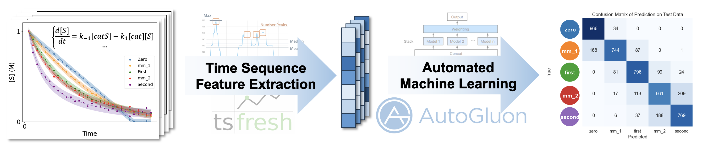

# Classification_of_Substrate_Orders_in_Reaction_Kinetics

## Overview


This repository contains the source data and codes for paper "Mechanistic Studies on Condensation Polymerization of C3 Propargylic Electrophiles". The paper is currently under review.

## Table of Contents

- [Overview](#overview)
- [Table of Contents](#table-of-contents)
- [Installation](#installation)
- [Generate ODE data and prepare the dataset](#generate-ode-data-and-prepare-the-dataset)
- [Training and Evaluation on Test data](#training-and-evaluation-on-test-data)
- [Analysis on the results](#analysis-on-the-results)
- [Inference on experimental data](#inference-on-experimental-data)
- [Benchmark for time-sequence deep learning models](#benchmark-for-time-sequence-deep-learning-models)
- [Citation](#citation)


## Installation

1. Git clone the repository
    - `git clone https://github.com/tom832/Classification_of_Substrate_Orders_in_Reaction_Kinetics.git`
    - `cd Classification_of_Substrate_Orders_in_Reaction_Kinetics`

2. Create conda environment from environment.yml (Recommended operating on a Linux machine)
    - `conda create -f environment.yml`
    - `conda activate cosork` stands for **C**lassification **O**f **S**ubstrate **O**rders in **R**eaction **K**inetics

3. Download and unzip the data and model
    - `bash download_data_and_model.sh`
    - you will see the following structure
    ```
    .
    ├── data
    │   ├── 5_class
    │   │   ├── raw (directory for raw data of each class)
    │   │   ├── train_val.csv
    │   │   ├── train_val_tsfresh_feat.csv
    │   │   ├── test.csv
    │   │   └── test_tsfresh_feat.csv
    │   ├── 6_class
    │   │   ├── raw (directory for raw data of each class)
    │   │   ├── train_val.csv
    │   │   ├── train_val_tsfresh_feat.csv
    │   │   ├── test.csv
    │   │   └── test_tsfresh_feat.csv
    │   └── ode_raw_data (directory for raw data of ODE)
    └── AutogluonModels
        ├── 5_class
        │   └── tsfresh_raw_feat__s__best_quality_3.0h (best model used in research)
        └── 6_class
            └── tsfresh_raw_feat__s__best_quality_3.0h (best model used in research)

    ```

## Generate ODE data and prepare the dataset

1. use python scripts under [`./solve_ode_scripts`](./solve_ode_scripts/) to generate ODE data (json files) in [`./data/ode_raw_data`](./data/ode_raw_data/) which has been provided in the above downloading step. Example bash script is provided in [`./solve_ode_scripts/solve_ivp_example.sh`](./solve_ode_scripts/solve_ivp_example.sh).
    ```
    .
    └── solve_ode_scripts
        ├── solve_ivp_example.sh (example script to generate 7-detailed-class ODE data)
        ├── solve_ivp_double.py
        ├── solve_ivp_single.py
        └── solve_ivp_single_outside.py
    ```

2. use notebook [`./prepare_data.ipynb`](./prepare_data.ipynb) to prepare the tabular data for training. The following steps are included:
    - Read the json raw data, transform 7 detailed classes into 5 or 6 general classes, and collect them in `./data/x_class/raw/xxx__all.csv` files
    - Stratifiedly and randomly choose 10k data for each general class as `./data/x_class/raw/xxx__10k.csv` files
    - Stratifiedly and randomly split 10% data as test data `./data/x_class/test.csv` and the rest as train and validation data `./data/x_class/train_val.csv`
    - Extract the tsfresh features as `./data/x_class/train_val_tsfresh_feat.csv` and `./data/x_class/test_tsfresh_feat.csv` files


## Training and Evaluation on Test data
- `python ag_train.py`, parameters are as follows, or you can use `ag_train.sh` to train the models with different parameters.
```
>> python ag_train.py -h

Training arguments for classification of substrate orders in reaction kinetics.

options:
  -h, --help               show this help message and exit
  --sp_mode                Which concentration profile(s) to use: s, p or sp. s: substrate, p: product, sp: substrate and product. Default=s
  --class_num              Number of classes: 5 or 6. Default=5
  --feat                   Feature type: tsfresh_raw, tsfresh or raw. Default=tsfresh_raw
  --ag_train_quality       Autogluon train quality: best_quality, high_quality, good_quality or medium_quality. Default=best_quality
  --hours                  Training time limit in hours. Default=3.0
  --num_cpus               Number of CPUs, 0 means using all CPUs. Default=0
  --num_gpus               Number of GPUs: 0 or 1. Default=1
  --verbose                Verbosity level: 0 to 4. Default=2
  --evaluate_on_test_data  Evaluate on test data. Default=False
```

- Example 1: train 6-class classification model with raw features using 4 CPUs and no GPU for 0.1 hours on medium quality with verbose log to quickly check the training process, and do not evaluate on test data finally.
```
python ag_train.py \
    --sp_mode s \
    --class_num 6 \
    --feat raw \
    --ag_train_quality medium_quality \
    --hours 0.1 \
    --num_cpus 4 \
    --num_gpus 0 \
    --verbose 2
```

- Example 2: train 5-class classification model with tsfresh and raw features using 1 GPU(cuda) and all CPU for 3 hours on best quality without verbose log, and evaluate on test data finally.
```
python ag_train.py \
    --sp_mode s \
    --class_num 5 \
    --feat tsfresh_raw \
    --ag_train_quality best_quality \
    --hours 3.0 \
    --num_cpus 0 \
    --num_gpus 1 \
    --verbose 0 \
    --evaluate_on_test_data
```
Note: AutoGluon training with `best_quality` would not prefer to use GPU due to distributed training and better performance for LightGBM models.

## Analysis on the results

Jupyter notebook [`ag_result_analysis.ipynb`](./ag_result_analysis.ipynb) is provided for analysis on the results of the trained models.

Including the following for 5-class and 6-class separately:
1. Autogluon Model leaderboard on validation data
2. Evaluation and performance on test data
3. Confuxion matrix heatmap of prediction on test data
4. Chord diagram of prediction on test data
5. Probability distribution of prediction on test data (Figure 4e in the paper)
6. Benchmark for the data size (Figure S3)
7. Benchmark for the feature type (Table S3)
8. Benchmark for the training time

## Inference on experimental data

Jupyter notebook [`ag_experiments.ipynb`](./ag_experiments.ipynb) and wet-lab data [`./experimental_data/data.csv`](./experimental_data/data.csv) is provided for inference on experimental data.

1. Prepare the experimental data
    - Read raw data
    - Normalize the time and concentration
    - Fit the concentration-time curve and obtain the 30 data points with equal time intervals to align with the model input
    - Extract the tsfresh features and concatenate with the raw features as the tabular input for Autogluon model
2. Load the trained model
3. Inference on the experimental data
4. Visualization of the prediction results (Figure 5c and 6 in the paper)

You can use your own experimental data with a column of time and a column of concentration like the provided [`./experimental_data/data.csv`](./experimental_data/data.csv) to do the inference.

## Benchmark for time-sequence deep learning models

Jupyter notebook [`benchmark_tsai.ipynb`](./benchmark_tsai.ipynb) is provided for benchmarking the time-sequence deep learning models. You can try to train and test different deep learning time-sequence models with this [notebook](./benchmark_tsai.ipynb).

Evaluation results on the test data of the trained tsai models are provided in [`./tsai_models/5_class__s/archs_results.csv`](./Tsai_Models/5_class__s/archs_results.csv)

## Citation
 
 To be updated.